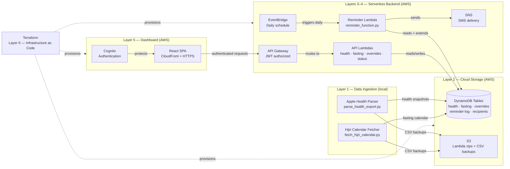

# Fasting Health Dashboard and Reminder Service


Personal fasting tracking dashboard and automated reminder service built around Islamic fasting practices.

It integrates with Apple Health data (sleep, heart rate, steps, calories) obtained from Apple Watch to analyze health trends under both fasting and non-fasting conditions. Also sends SMS reminders to subscribed users of key obligatory and supererogatory fasting dates in the Islamic (Hijri) calendar.

This project was designed after my mother got mad at me for forgetting to remind her to fast with me, after I suddenly remembered at midnight the night before.

This problem cannot be addressed by a typical calendar app due to the dynamic nature of the Hijri lunar calendar, which changes based on the sighting of the new crescent moon. The project combines personal health analytics, full-stack development, cloud infrastructure, and serverless automation into a single cohesive system.

**Live:** https://d225kyvnm52aug.cloudfront.net _(requires authentication — or click **Try Demo** on the login screen!)_

## Table of Contents

- [Features](#features)
- [Architecture](#architecture)
- [Scaling Considerations](#scaling-considerations)
- [Tech Stack](#tech-stack)
- [Project Structure](#project-structure)
- [Setup & Installation](#setup--installation)
- [Usage](#usage)
- [Design Decisions](#design-decisions)
- [Testing](#testing)
- [Security and Privacy](#security-and-privacy)
- [Roadmap](#roadmap)
- [License](#license)

## Features

- **Islamic Fasting Calendar** — Dynamically computes fasting schedule via the AlAdhan API, classifying Ramadan, Ayyam al-Bid, Arafah, Ashura, Dhul Hijjah, and weekly Sunnah fasts with full Hijri date mapping and a self-extending 90-day horizon.
- **Apple Health Integration** — Parses native XML exports from Apple Watch, extracting sleep, resting heart rate, active calories, and step count for correlation analysis.
- **Health Trend Dashboard** — React SPA with interactive charts, Welch's t-test significance testing, linear regression trend detection, and fasting type colour coding across configurable date ranges. Results are exploratory and based on personal Apple Health data — not intended for medical diagnosis or clinical generalization.
- **Automated SMS Reminders** — Daily Lambda sends multilingual reminders (English + Bengali) via SNS with idempotent deduplication, Eid greetings, and recipients managed live from DynamoDB.
- **Fasting Overrides** — Mark extra or skipped fasts via the dashboard, persisted to DynamoDB and immediately reflected in both the calendar and health trends.
- **Infrastructure as Code** — All AWS resources defined in Terraform across six reusable modules, reproducible with a single `terraform apply`. Protected by Cognito JWT authorization and least-privilege IAM policies.
- **Operational Observability** — CloudWatch metric alarms on all five Lambda functions and DynamoDB throttling, system status panel with live log integration, and email alerting via SNS.

## Architecture

The project is structured in six layers:

**Layer 1 — Data Ingestion** _(local Python scripts)_

Parses Apple Health XML exports to extract key health metrics. Fetches Gregorian-to-Hijri date mappings from the AlAdhan API and classifies each day against Islamic fasting types.

**Layer 2 — Cloud Storage** _(AWS DynamoDB + S3)_

Processed health snapshots and fasting records are uploaded to DynamoDB for fast key-based querying. DynamoDB uses a composite key of `date` + `metric` for health data and `date` alone for fasting records. S3 stores Lambda deployment packages and CSV backups.

**Layer 3 — Automation** _(AWS Lambda + EventBridge)_

A scheduled Lambda function runs daily to send SMS reminders via SNS for upcoming fasting dates, deliver Eid greetings, and self-extend the fasting calendar horizon to maintain 60 days of future records.

**Layer 4 — API Layer** _(AWS API Gateway + Lambda)_

Five Lambda functions expose a REST API protected by Cognito JWT authorization. The browser never touches DynamoDB directly — all credentials stay server-side.

The seven endpoints:

| Method | Path       | Auth | Description                                    |
| ------ | ---------- | ---- | ---------------------------------------------- |
| GET    | /health    | JWT  | Health snapshots with date range filtering     |
| GET    | /fasting   | JWT  | Fasting calendar with override merging         |
| GET    | /overrides | JWT  | All user fasting overrides                     |
| POST   | /overrides | JWT  | Create extra or skipped fast override          |
| PUT    | /overrides | JWT  | Update existing override                       |
| DELETE | /overrides | JWT  | Remove override by date                        |
| GET    | /status    | None | System health, CloudWatch logs, recipient list |

**Layer 5 — Dashboard** _(React, hosted on CloudFront)_

A React single-page application (SPA) served over HTTPS via AWS CloudFront, protected by Cognito authentication. Features an interactive fasting calendar with Hijri dates, health trend analysis with statistical significance testing, fasting override management, and a live system status panel

**Layer 6 — Infrastructure as Code** _(Terraform)_

All AWS resources defined across seven Terraform modules (storage, lambda, api, notifications, auth, frontend, monitoring). Reproducible with `terraform apply`. Deploy scripts handle code packaging and S3/CloudFront updates separately from infrastructure changes.

See [`adr/`](./adr) for the architectural decisions behind each major design choice.

Diagram included below.



## Scaling Considerations

The current architecture is designed for personal use at minimal, almost negligible, cost.
Here is how each layer would evolve when scaled up.

**Data Ingestion**

Currently processed manually — one user exports Apple Health XML locally and runs Python scripts. Scaling to multiple users would require a web-based upload pipeline with individual S3 prefixes and a queued processing system via SQS to handle uploads.

**DynamoDB**

Pay-per-request billing scales automatically with read/write volume. The current key design (date + metric for health-snapshots) supports efficient range queries per user but would require a user_id partition key addition. For complex analytical queries across users, migration to Aurora Serverless is planned (see ADR-012).

**S3**

Currently stores Lambda deployment zips and CSV backups at negligible cost. Multi-user support would require per-user prefixes (`exports/{user_id}/`) for Apple Health uploads and lifecycle policies to expire raw exports after processing. At 100 users uploading bi-weekly exports (~50MB each), monthly storage cost remains under $1.

**Lambda**

All five Lambda functions scale automatically. The reminder function is intentionally kept as a single daily execution with idempotent guards rather than a distributed job to avoid over-engineering at personal scale.

**API Gateway**

Default quotas are far beyond current scale. Rate limiting would be added before opening the platform to external users.

**Cognito**

Supports up to 10,000 monthly active users on the free tier. For multi-user support, self-service registration with email verification would be enabled.

**Cost Profile at Scale**

At 100 users with daily active use: estimated $15-25/month (DynamoDB reads, Lambda invocations, CloudFront data transfer). The serverless architecture means near-zero cost at idle usage, making it appropriate for personal and small-team deployments.

**Privacy at Scale**

Multi-user support would require PIPEDA compliance review for Canadian users, per-user data isolation at the DynamoDB and S3 layers, and a formal data retention and deletion policy. See [`SECURITY.md`](./SECURITY.md).

## Tech Stack

| Category            | Technology                | Purpose                                                           |
| ------------------- | ------------------------- | ----------------------------------------------------------------- |
| **Languages**       | Python 3.13, JavaScript   | Backend ingestion and Lambda functions, React frontend            |
| **Cloud Compute**   | AWS Lambda + EventBridge  | Five serverless API endpoints + daily reminder automation         |
| **Cloud Storage**   | AWS DynamoDB + S3         | Health records, fasting calendar, overrides; deployment artifacts |
| **Notifications**   | AWS SNS                   | Multilingual SMS reminders                                        |
| **Auth & Security** | AWS Cognito + API Gateway | JWT authorization, HTTPS, least-privilege IAM                     |
| **CDN**             | AWS CloudFront            | HTTPS delivery, global edge caching                               |
| **Infrastructure**  | Terraform                 | All AWS resources as code, seven modules                          |
| **Frontend**        | React 18 + Recharts       | SPA dashboard with interactive health charts                      |
| **Testing**         | pytest + moto             | Unit and integrative (AWS)                                        |
| **CI/CD**           | GitHub Actions            | pytest + mypy on every push                                       |
| **Data Processing** | pandas, boto3             | Health XML parsing, AWS SDK                                       |
| **External API**    | AlAdhan                   | Gregorian-to-Hijri calendar conversion                            |
| **Data Source**     | Apple Health XML export   | Health metrics via manual export from iPhone                      |

## Project Structure

```
fasting-tracker/
├── ingestion/               # Local data pipeline — Apple Health XML parsing and Hijri calendar fetching
├── lambda_function/         # Five AWS Lambda functions (reminder, health API, fasting API, overrides, status)
├── frontend/src/            # React dashboard (components, hooks, API client, demo data)
├── tests/                   # 266 pytest tests — unit and moto AWS integration
├── terraform/
│   ├── environments/prod/   # Production Terraform entry point
│   └── modules/             # Seven modules: storage, lambda, api, auth, frontend, notifications, monitoring
├── adr/                     # 23 Architecture Decision Records
├── deploy.sh                # Full deployment (Lambda + frontend)
├── deploy-lambda.sh         # Single Lambda function deployment
├── deploy-frontend.sh       # Frontend build and S3/CloudFront deploy
└── SECURITY.md              # Security policy and data handling
```

## Setup & Installation

### Prerequisites

- Python 3.13
- Node.js 18+
- Git
- Terraform 1.0+
- AWS CLI v2, configured with appropriate IAM permissions
- An Apple Health XML export from the Health app on iPhone (Apple Watch data recommended for richer metrics)

### Infrastructure Setup

This project uses Terraform to manage all AWS resources and deploy scripts to package and upload Lambda functions and the React frontend. They serve different purposes:

- **Terraform** — creates and manages AWS resources (DynamoDB tables, Lambda functions, API Gateway, Cognito, CloudFront). Run once to provision infrastructure, then again when infrastructure changes.
- **Deploy scripts** — package Python code into Lambda zips, upload to S3, and deploy the React frontend to CloudFront. Run after every code change.

### Steps

1. **Clone the repository**

```bash
git clone https://github.com/rrzaman/fasting-tracker.git
cd fasting-tracker
```

2. **Create and activate a virtual environment**

```bash
python -m venv venv
source venv/Scripts/activate  # Windows (Git Bash)
source venv/bin/activate      # macOS / Linux
```

3. **Install dependencies**

```bash
pip install -r requirements.txt
```

4. **Configure environment variables**

Create a `.env` file in the project root:

```
AWS_ACCESS_KEY_ID=your_access_key
AWS_SECRET_ACCESS_KEY=your_secret_key
AWS_REGION=ca-west-1
```

5. **Provision AWS infrastructure**

```bash
cd terraform/environments/prod
terraform init
terraform apply
```

6. **Deploy Lambda functions and frontend**

```bash
./deploy.sh
```

7. **Add your Apple Health export**

Export from the Health app on iPhone → **Export All Health Data**, unzip, and place `export.xml` inside the `data/` folder.

8. **Run the ingestion pipeline**

```bash
python ingestion/parse_health_export.py
python ingestion/fetch_hijri_calendar.py
python ingestion/upload_to_aws.py
```

## Usage

### Day-to-day

After deployment, the system runs automatically. AWS Lambda runs every evening, sending SMS reminders to all subscribed recipients one day ahead of upcoming fasting dates with no manual interaction required.

### Updating health data

Apple Health does not provide a public API, so data must be exported manually every 1–2 weeks. Currently searching for alternatives to automate this process.

1. Open the **Health** app on iPhone → tap your profile picture → **Export All Health Data**
2. Unzip the export and place `export.xml` into the `data/` folder
3. Run the ingestion pipeline:
   ```bash
   python ingestion/parse_health_export.py
   python ingestion/upload_to_aws.py
   ```

### Adding or removing notification recipients

Add recipients directly to the `notification-recipients` DynamoDB table with `phone`, `name`, and `lang` fields. New recipients must first be verified in the AWS SNS sandbox before they can receive messages.

### Extending the fasting calendar manually

The Lambda function self-extends the calendar automatically. To regenerate from scratch or backfill historical dates:

```bash
python ingestion/fetch_hijri_calendar.py
python ingestion/upload_to_aws.py
```

## Design Decisions

See [`adr/`](./adr) for detailed design decisions.

## Testing

The project includes 266 tests across two layers:

- **Unit tests** — pure Python functions covering message building, fasting day classification, and date formatting
- **Integration tests** — moto-based AWS mocking covering all five Lambda functions, including DynamoDB reads/writes, override merging, idempotency guards, and HTTP API v2 event shapes
- **Coverage** — 97% across all Python Lambda functions and ingestion scripts (backend only)

Run the full suite:

```bash
pytest -v
mypy lambda_function/ ingestion/ --ignore-missing-imports --explicit-package-bases
```

## Security and Privacy

Health data (heart rate, sleep, steps, calories) is stored privately in AWS DynamoDB and never committed to version control. The dashboard requires Cognito authentication — only authorized users can access personal data. AWS credentials are stored in environment variables, never in source code.
See [`SECURITY.md`](./SECURITY.md) for full details.

## Roadmap

- ✅ **April 2026:** Lambda deployment, automated SMS reminders, initial AWS infrastructure
- ✅ **April 2026:** React dashboard, API Gateway, CloudFront, Cognito authentication, Terraform IaC
- ✅ **April 2026:** Demo mode, idempotent reminders, CloudWatch system status, deployment tooling
- ✅ **May 2026:** JWT authorization, IAM least-privilege, moto integration tests, statistical health analysis, recipients from DynamoDB, visual enhancements
- **Planned:** Mobile responsive design, deeper health analytics (HRV, sleep stages), automated Apple Health ingestion
- **Long-Term:** Multi-user support, custom domain, Aurora Serverless for health analytics

## License

Licensed under the MIT License. See [`LICENSE`](./LICENSE) for details.
