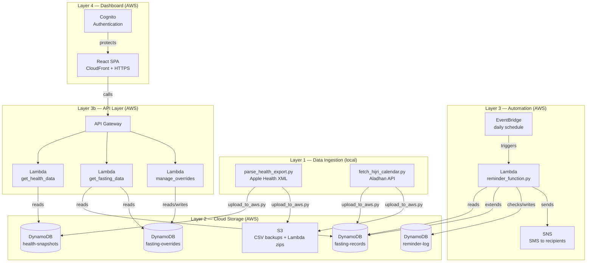

# Fasting Health Dashboard and Reminder Service


Personal fasting tracking dashboard and automated reminder service built around Islamic fasting practices.

It integrates with Apple Health data (sleep, heart rate, steps, calories) obtained from Apple Watch to analyze health trends under both fasting and non-fasting conditions. Also sends SMS reminders to subscribed users of key obligatory and supererogatory fasting dates in the Islamic (Hijri) calendar.

This project was designed after my mother got mad at me for forgetting to remind her to fast with me, after I suddenly remembered at midnight the night before.

This problem cannot be addressed by a typical calendar app due to the dynamic nature of the Hijri lunar calendar, which changes based on the sighting of the new crescent moon. The project combines personal health analytics, full-stack development, cloud infrastructure, and serverless automation into a single cohesive system.

**Live:** https://d225kyvnm52aug.cloudfront.net _(requires authentication)_

## Table of Contents

- [Features](#features)
- [Architecture](#architecture)
- [Tech Stack](#tech-stack)
- [Project Structure](#project-structure)
- [Setup & Installation](#setup--installation)
- [Usage](#usage)
- [Design Decisions](#design-decisions)
- [Roadmap](#roadmap)
- [License](#license)

## Features

- **Apple Health Integration** — Parses native XML exports from Apple Watch, extracting sleep, resting heart rate, active calories, and step count.
- **Islamic Fasting Calendar** — Dynamically computes fasting schedule using the Aladhan API, classifying Ramadan, Ayyam al-Bid, Arafah, Ashura, Dhul Hijjah, and weekly Sunnah fasts with full Hijri date mapping.
- **Cloud Storage Pipeline** — Processed health and fasting data uploaded to AWS S3 (file backup) and DynamoDB (queryable records).
- **Self-Maintaining Calendar** — AWS Lambda automatically extends the fasting calendar horizon, requiring no manual intervention.
- **SMS Reminder Service** — Automated weekly reminders via AWS SNS to multiple recipients before upcoming fasting dates, including Eid greetings.
- **Health Trend Analysis** — Correlates fasting days with health metrics to surface trends across fasting vs. non-fasting conditions.
- **Personal Dashboard** — React-based web interface for viewing calendar, health correlations, and managing fasting overrides.
- **Fasting Overrides** — Mark extra or skipped fasts via the dashboard, persisted to DynamoDB.
- **Multilingual Reminders** — SMS reminders in English and Bengali for family recipients.

## Architecture

The project is structured in four layers:

**Layer 1 — Data Ingestion** _(local Python scripts)_
Parses Apple Health XML exports to extract key health metrics. Separately fetches Gregorian-to-Hijri date mappings from the AlAdhan API and classifies each day against a list of common Islamic fasting days.

**Layer 2 — Cloud Storage** _(AWS S3 + DynamoDB)_
Processed health snapshots and fasting records are uploaded to DynamoDB for fast key-based querying, with CSV backups stored in S3. DynamoDB uses a composite key of `date` + `metric` for health data and `date` alone for fasting records.

**Layer 3 — Automation** _(AWS Lambda + EventBridge)_
A scheduled Lambda function runs weekly to send SMS reminders via SNS for upcoming fasting dates, deliver Eid greetings, and self-extend the fasting calendar horizon to maintain 60 days of future records.

**Layer 4 — Dashboard** _(React, hosted on S3)_
A React single-page application served via AWS CloudFront with HTTPS, protected by AWS Cognito authentication. Fetches data through API Gateway endpoints backed by Lambda functions. Features an interactive fasting calendar with Hijri dates, health trend charts with fasting correlation, and fasting override management.

**Layer 5 — Infrastructure as Code** _(Terraform)_
All AWS infrastructure is defined and version controlled using Terraform, organized into reusable modules for storage, Lambda, API Gateway, Cognito, CloudFront, notifications, and frontend. The entire environment can be reproduced from a single `terraform apply` command.

See [`adr/`](./adr) for the architectural decisions behind each major design choice.

Diagram included below.



## Tech Stack


| Category            | Technology               | Purpose                                                         |
| ------------------- | ------------------------ | --------------------------------------------------------------- |
| **Languages**       | Python 3.10+, JavaScript | Backend ingestion and automation, React frontend                |
| **Cloud Compute**   | AWS Lambda + EventBridge | Serverless weekly reminder function, self-triggered on schedule |
| **Cloud Storage**   | AWS DynamoDB             | Queryable fasting and health records                            |
| **Cloud Storage**   | AWS S3                   | CSV backups and static frontend hosting                         |
| **Notifications**   | AWS SNS                  | SMS reminders                                                   |
| **Auth**            | AWS Cognito              | User authentication and session management                      |
| **CDN**             | AWS CloudFront           | HTTPS static hosting with global edge caching                   |
| **API**             | AWS API Gateway          | REST API layer between frontend and DynamoDB                    |
| **Infrastructure**  | Terraform                | Infrastructure as Code for all AWS resources                    |
| **Testing**         | pytest + GitHub Actions  | Unit tests with CI on every push                                |
| **Charting**        | Recharts                 | Interactive health trend visualizations                         |
| **Frontend**        | React                    | Personal health dashboard                                       |
| **Data Processing** | pandas, boto3            | Health data aggregation, AWS SDK for Python                     |
| **External API**    | AlAdhan                  | Gregorian-to-Hijri calendar conversion                          |
| **Data Source**     | Apple HealthKit          | Health metrics via XML export from Apple Watch                  |

## Project Structure

```
fasting-tracker/
├── adr/                                # Architecture Decision Records
├── ingestion/                          # Local data pipeline scripts
│   ├── parse_health_export.py
│   ├── fetch_hijri_calendar.py
│   └── upload_to_aws.py
├── lambda_function/                    # AWS Lambda functions
│   ├── reminder_function.py            # Daily SMS reminders + calendar horizon
│   ├── get_health_data.py              # API: health snapshots endpoint
│   ├── get_fasting_data.py             # API: fasting calendar endpoint
│   └── manage_overrides.py             # API: fasting overrides CRUD
├── frontend/                           # React dashboard
│   └── src/
│       ├── hooks/
│       │   └── useDashboardData.js
│       ├── constants.js
│       ├── App.jsx
│       ├── api.js
│       ├── cognitoConfig.js
│       └── components/
│           ├── CrescentMoon.jsx
│           ├── FastingCalendar.jsx
│           ├── HealthTrends.jsx
│           ├── Settings.jsx
│           └── StarCanvas.jsx
├── tests/                              # pytest unit tests
│   ├── test_build_message.py
│   ├── test_classify_day.py
│   └── test_format_date.py
├── data/                               # gitignored
├── deploy.sh                           # Full deployment script
├── requirements.txt
├── ROADMAP.md
└── README.md
```

## Setup & Installation

### Prerequisites

- Python 3.10+
- Git
- An AWS account with S3, DynamoDB, and SNS configured (see [`adr/`](./adr))
- An Apple Health XML export from the Health app on iPhone, optimally with Apple Watch health data (steps, heart rate, sleep, etc.)

### Steps

1. **Clone the repository**

```bash
   git clone https://github.com/rrzaman/fasting-tracker.git
   cd fasting-tracker
```

2. **Create and activate a virtual environment**

```bash
   python -m venv venv
   source venv/Scripts/activate  # Windows (Git Bash)
   source venv/bin/activate      # macOS / Linux
```

3. **Install dependencies**

```bash
   pip install -r requirements.txt
```

4. **Configure environment variables**

   Create a `.env` file in the project root:

```
   AWS_ACCESS_KEY_ID=your_access_key
   AWS_SECRET_ACCESS_KEY=your_secret_key
   AWS_REGION=ca-west-1
   PHONE_NUMBER_1=+1xxxxxxxxxx
```

5. **Add your Apple Health export**

   Export your data from the Health app on iPhone, unzip it, and place `export.xml` inside the `data/` folder.

6. **Run the ingestion pipeline**

```bash
   python ingestion/parse_health_export.py
   python ingestion/fetch_hijri_calendar.py
   python ingestion/upload_to_aws.py
```

## Usage

### Day-to-day

After deployment, the system runs automatically. AWS Lambda checks for upcoming fasting dates every Sunday evening and sends SMS reminders to all subscribed recipients — no manual interaction required.

### Updating health data

Apple Health does not provide a public API, so data must be exported manually every 1–2 weeks. Currently searching for alternatives to automate this process.

1. Open the **Health** app on iPhone → tap your profile picture → **Export All Health Data**
2. Unzip the export and place `export.xml` into the `data/` folder
3. Run the ingestion pipeline:
   ```bash
   python ingestion/parse_health_export.py
   python ingestion/upload_to_aws.py
   ```

### Adding or removing notification recipients

Update the phone numbers in the local `.env` file and in the Lambda environment variables in the AWS console.

### Extending the fasting calendar manually

The Lambda function self-extends the calendar automatically. To regenerate from scratch or backfill historical dates:

```bash
python ingestion/fetch_hijri_calendar.py
python ingestion/upload_to_aws.py
```

## Design Decisions

See [`adr/`](./adr) for detailed design decisions.

## Roadmap

- ✅ **April 2026:** Lambda deployment, automated SMS reminder system, initial AWS infrastructure.
- ✅ **April 2026:** React dashboard, API Gateway, CloudFront deployment, Cognito authentication.
- **May 2026:** Demo mode with synthetic data for public portfolio viewing.
- **May 2026:** Deeper health analytics. Heart rate variability, sleep stage breakdown during fasting, focus on fasting hours (Fajr to Maghrib).
- **Long-Term:** Automated Apple Health ingestion via scheduled Mac script or iOS Shortcut.
- **Long-Term:** Multi-user support with individual dashboards and personalized fasting schedules.

## License

Licensed under the MIT License. See [`LICENSE`](./LICENSE) for details.
